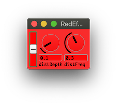
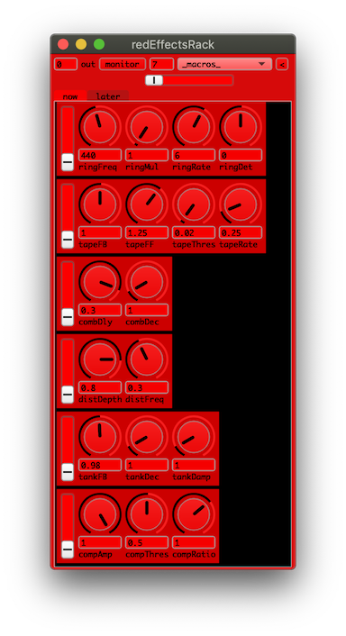
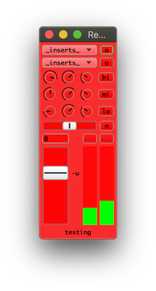
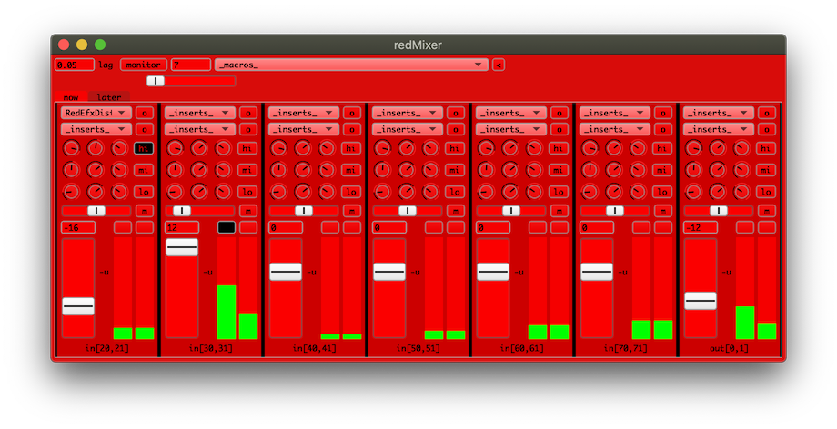
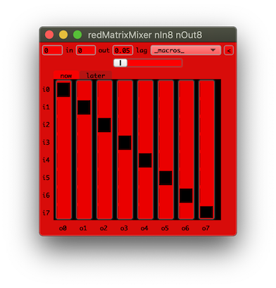
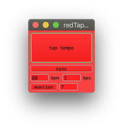

a [Quark](https://supercollider-quarks.github.io/quarks/) for [SuperCollider](https://supercollider.github.io)

install it from within supercollider with the command `Quarks.install("redSys")` and then recompile.

# redSys

red system including mixers, effects, instruments, presets, tools, compression algorithms, gui...

| redEffects (sound modulators)  | |
| ------------- | ------------- |
| RedEfxAuto | auto tuner |
| RedEfxBit8 | bitcrusher with ringmodulation |
| RedEfxBitc | bitcrusher |
| RedEfxBitx | bitcrusher |
| RedEfxBoom | boomeranging effect |
| RedEfxComb | comb delay |
| RedEfxComp | compressor |
| RedEfxDelp | delay with pitchshift |
| RedEfxDely | delay |
| RedEfxDist | distortion |
| RedEfxGuit | guitar amp |
| RedEfxFreq | frequency shifter |
| RedEfxOcta | octavider |
| RedEfxPch2 | pitch shifter |
| RedEfxPchN | pitch shifter |
| RedEfxRing | ring modulator |
| RedEfxRoom | reverb |
| RedEfxRvrs | reverses sound |
| RedEfxTanh | distortion |
| RedEfxTank | tank reverb |
| RedEfxTape | tape echo |
| RedEfxWave | waveshaping |
| RedEfxVerb | reverb |
| RedEfxVoco | vocoder |
| RedEfxZzzz | limiter and check bad values |

| redEffectsRack (effects system) | |
| ------------- | ------------- |
| RedEffectsRack | allround effects rack for RedEffectModule |
| RedEffectsRackGUI | gui for RedEffectsRack |

| redGUI (gui) | |
| ------------- | ------------- |
| redGUIOverview | overview of gui wrappers |

| redInstrument (sound generators) | |
| ------------- | ------------- |
... TODO!!!

| redMatrixMixer (matrix mixing) | |
| ------------- | ------------- |
| RedMatrixMixer | mix any number of input and output channels |
| RedMatrixMixerGUI | gui for RedMatrixMixer |

| redMix (small mixer units) | |
| ------------- | ------------- |
| redMixOverview | overview of redMix classes |
| RedAbstractMix | abstract class |
| RedMixGUI | gui for RedMixMono, RedMixStereo, RedMixStereoMono |
| RedMixMono | mix 2 mono channels in stereo |
| RedMixStereo | mix 2 stereo channels in stereo |
| RedMixStereoMono | mix 1 stereo channel and 1 mono channel in stereo |

| redMixer (mixer system) | |
| ------------- | ------------- |
| RedMixer | create and hold multiple RedMixerChannel |
| RedMixerChannel | channel strip |
| RedMixerChannelGUI | gui for RedMixerChannel |
| RedMixerGUI | gui for RedMixer |

| redModule (modular system) | |
| ------------- | ------------- |
| RedAbstractModule | abstract class |
| RedEffectModule | abstract class |
| RedEffectModuleGUI | gui for RedEffectModule |
| RedInstrumentModule | abstract class |
| RedInstrumentModuleGUI | gui for RedInstrumentModule |

| redSF (sound file player) | |
| ------------- | ------------- |
| RedSFPlayer | play soundfiles from memory |
| RedSFPlayerDisk | play soundfiles from disk |

| redTapTempo (tap tempo) | |
| ------------- | ------------- |
| RedTapTempoGUI | average tempo of the last n taps/clicks |
| RedTempoClockGUI | list and edit active tempo clocks |

| redTest (test signals) | |
| ------------- | ------------- |
| RedTest | generate test signals |

| redTools (various) | |
| ------------- | ------------- |
| RedALF | ascii to list-of-floats conversion |
| RedArduino | for uploading sketches to arduino |
| RedBase64 | base64 encoding/decoding |
| RedBencode | bencode encoder and decoder |
| RedBitStream | stream bits |
| RedBMP | bitmap image |
| RedDifferentialManchesterCode | differential manchester encoding |
| RedDifferentialManchesterCodeNegative | differential manchester encoding |
| RedGIF | gif image decoder |
| RedHarmonicTree | sorted harmonic tree |
| RedHuffman | huffman coding |
| RedIntelHex | read and decode intel hex files |
| RedInterpolator | holds a value and interpolates to new target |
| RedKCS | kansas city standard encoder/decoder for sclang and server |
| RedLZ77 | lz77 compression/decompression |
| RedLZ78 | lz78 compression/decompression |
| RedLZSS | lzss compression/decompression |
| RedLZW | lzw compression/decompression |
| RedManchesterCode | manchester encoding |
| Redraw | simple drawing with the mouse |
| RedRLE | run-length compression/decompression |
| RedSmooth | single exponential smoothing |
| RedSmooth2 | double exponential smoothing |
| RedSmoothUD | single exponential smoothing with different rise/fall |
| RedTime | calculate with time |
| RedToolsMenu | various tools |
| RedTween | tweening for sclang and scserver |

| redUGens (pseudo ugens) | |
| ------------- | ------------- |
| RedAutoScale | scales an unknown signal to a known range |
| RedBernoulli | white noise with Bernoulli distribution |
| RedComb | comb delay line with crossfade |
| RedDelay | delay line with crossfade |
| RedDestroyer | distortion effect |
| RedDTMF | old-skool telephone |
| RedFrik | noise socks! |
| RedDirection | detects inc/dec of a signal |
| RedImpulse | resettable impulse train |
| RedLFSR4 | 4-bit linear feedback shift register |
| RedLFSR4BitStream | 4-bit linear feedback shift register |
| RedLine | resettable line generator |
| RedLive | sample and repeat |
| RedOnePole | one pole filter with separate up and down coefficients |
| RedOverdub | overdub recording |
| RedRamp | resettable phasor with per period rate control |
| RedSequencer | simple sequencer |
| RedSequencer2 | simple sequencer |
| RedSlide | logarithmic lag |
| RedStereo | panning effect |
| RedStereo2 | panning effect |
| RedTapeRecorder | sampling and looping |

## Dependancies

Some of the gui classes need the [TabbedView2](https://github.com/supercollider-quarks/TabbedView2) quark (should get automatically installed when installing this quark)

## Screenshots:

Most classes do not have a GUI, but here are a few screenshots of ones that do...

## Changelog:

* 221218 - added RedBernoulli
* 220814 - added RedSmooth, RedSmooth2, RedSmoothUD
* 220731 - added RedKCS, added overview to this readme
* 220116 - added a few screenshots, helpfile cleanup
* 220115 - rewrite to use TabbedView2 instead of TabbedView (about time)
* 220114 - redMix, redTapTempo, redMixer, redMatrixMixer, redEffectsRack, redModule - rework gui and helpfiles
* 210610 - huge speed improvements to most data compression classes, RedGIF massive speed improvements and important fixes
* 210526 - RedBMP add support for Image
* 180330 - RedIntelHex checksum bugfix
* 180317 - redModule and redEffectsRack: added global lag
* 180218 - replaced a few .interpret in hex-string to integer conversion
* 180116 - new readme. dropped Conductor quark dependency. cleanup helpfiles. fixed RedTapeRecorder. minor bugfix to RedTest. major rewrite of redMatrixMixer, redMix, redMixer, redGUICV, redModule, redEffectsRack
* 151124 - RedTapTempoGUI - alpha
* 131228 - added default values for RedTime-new and some more examples
* 130927 - minor speed up by replacing & with bitAnd, << with leftShift and >> with rightShift
* 130902 - added RedTween and RedInterpolator
* 130807 - added RedArduino
* 130612 - added RedLFSR4 and RedLFSR4BitStream
* 130524 - added RedIntelHex
* 130522 - added RedManchesterCode, RedDifferentialManchesterCode, RedDifferentialManchesterCodeNegative. removed all old html helpfiles and the redSys.html overview
* 130226 - added RedBencode
* 130131 - RedTest: added dur arguments
* 130108 - RedTest: added amp arguments
* 121126 - RedEfxKomp: postGain was in the wrong place, changed default postGain from 0.25 to 1. RedTest: speaker and speaker2 classmethods also boot default server, fix initRedTestSF to read correct sound
* 121007 - RedMixer: thanks to Roberto Lombardo .store now also saves effect inserts and their settings
* 121005 - RedMixer: improved helpfile with more examples, bugfix for when only one stereo input, changes for save&recall
* 121001 - added RedTempoClockGUI
* 120825 - fix crashing bug in RedToolsMenu under qt
* 120608 - many gui windows did not show under sc3.5 cocoa osx due to alpha channel bug, now fixed
* 120317 - some minor fixes to look better with gui qt, fix for 3.5 random helpfile lookup in redtoolsmenu, removed RedEfxFFTA from redEffects because it needs sc3-plugins installed
* 120221 - added RedOnePole, RedSlide
* 120208 - added RedRamp
* 120205 - added RedLine
* 120122 - added RedImpulse
* 111115 - added RedEfxFreq, RedEfxRvrs, RedOverdub
* 111113 - added RedEfxAuto, RedEfxBoom, RedEfxFFTA, RedEfxKomp, RedEfxPch2, RedEfxPchN, RedEfxVoco. minor fix to RedAbstractModule - avoid multiple synthdef builds with a pdDef variable
* 110927 - all helpfiles converted to scdoc format
* 110920 - some first fixes to sc3.5 qt gui
* 110216 - added RedALF class. minor fix to RedAutoScale - changed to inf and -inf for min and max
* 101129 - RedBMP bugfixes, added support for reading 16bit files, added writing and creating 2, 4, 8, 16 and 24bit files.
* 101121 - RedFrik now needs GlitchRHPF from sc3-plugins. added RedBMP class. changed RedGIF to use smoothing_ instead of setSmoothing
* 100907 - some changes to RedToolsMenu, no separate Red menu any longer, using Library.
* 100728 - added RedSF, RedEfxBit8, RedEfxBitx, RedEfxRoom, RedEfxZzzz. added functions in comments for each effect, useful for pasting into ndef filters
* 100703 - changed some more memStore to add
* 100702 - changed some store and memStore to add. improvements to RedToolMenu: normalize and userview. bugfix in RedMatrixMixerGUI
* 100210 - minor changes to RedToolsMenu. bugfix for RedEfxComp
* 100124 - added RedGIF and RedBitStream. minor optimisation to RedLZW
* 100109 - bugfix for RedLZ78, swapped distance and length for RedLZ77 and RedLZSS, small optimisation to RedLZW
* 100107 - complete rewrite of RedLZ77 and RedLZSS
* 100101 - added RedLZ78. improved helpfiles for all compressors. RedHuffman changed from encode/decode to compress/decompress and to have it take all kinds of data. RedLZW now works with 8bit integers
* 091230 - added RedLZ77, RedLZSS. modified RedRLE to take arrays instead of strings
* 091229 - added RedRLE
* 091226 - added RedHuffman
* 091025 - some changes to RedToolsMenu. added Redraw
* 091009 - new effects: RedEfxDely, RedEfxWave, RedEfxDelp, RedEfxTanh. added a limiter to RedEfxTank. argument name changes for RedEfxOcta and RedEfxGuit. added template to RedEffectModule.sc file
* 090916 - added RedEfxTanh, RedEfxWave and a template in the RedEffectModule.sc file
